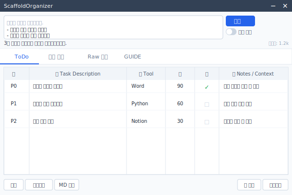

# ScaffoldOrganizer (Developer Guide)



로컬에서 실행되는 브레인 덤프 → 작업 구조화 앱입니다. OpenAI Prompt Asset 기반 Responses API로 자유 형식 입력을 구조화하고, Notion 친화 Markdown으로 내보냅니다.

> 📖 **앱을 사용하는 방법은 [GUIDE.md](GUIDE.md)** 를 참고하세요.  
> 이 문서는 개발자/빌드 담당자를 위한 기술 문서입니다.

## 프로젝트 목표
- 사고 추출 → 구조화 → 우선순위화 → 실행 단위 분해
- Prompt Asset이 사고 규칙과 단계 정의를 담당
- 로컬 앱은 출력(JSON/Markdown) 편집·저장·내보내기만 수행

## 프로젝트 구조

```
.
├── README.md               # 개발자 문서
├── GUIDE.md                # 사용자 가이드
├── config.json             # 실제 설정 (gitignored)
├── config_example.json     # 설정 템플릿
├── LICENSE
├── app/                    # 애플리케이션 소스
│   ├── main.py             # 진입점 — `python -m app.main`
│   ├── ui.py               # NiceGUI UI
│   ├── openai_client.py    # OpenAI Responses API 래퍼
│   ├── config.py           # 설정 로더
│   ├── db.py               # SQLite 스키마/CRUD
│   ├── exporter.py         # Notion Markdown 내보내기
│   ├── normalization.py    # 구조화 출력 → Task 파싱
│   ├── normalize.py        # Markdown 표 파싱
│   ├── models.py
│   └── schema.py
├── scripts/                # 빌드/스크립트
│   ├── main.spec           # PyInstaller 빌드 설정
│   ├── requirements.txt    # pip 의존성
│   ├── environment.yml     # conda/mamba 환경
│   ├── make_ico.sh         # Windows .ico 생성
│   ├── make_ico.ps1        # (PowerShell 버전, 선택)
│   └── make_iconset.sh     # macOS/Linux .icns 생성
├── assets/                 # 아이콘 등 정적 자원
│   ├── icon.png
│   ├── icon.ico
│   ├── icon.icns
│   └── appicon.svg
├── docs/                   # 문서/스크린샷
│   └── screenshot.svg
├── data/                   # SQLite DB (gitignored, 자동 생성)
└── exports/                # Markdown 출력 (gitignored)
```

## 주의사항

이 앱은 `native=True` 모드로 실행되므로 **`pywebview`** 가 별도로 필요합니다.

| 환경 | 설치 방법 |
|---|---|
| Windows | `pip install pythonnet pywebview` |
| macOS | `pip install pywebview` |
| Linux / WSL | `pip install pywebview` + `sudo apt install python3-gi python3-gi-cairo gir1.2-gtk-3.0 gir1.2-webkit2-4.0` |

> **Windows 주의사항:**  
> - `pywebview`는 내부적으로 `pythonnet`에 의존합니다.  
> - `pythonnet`은 **Python 3.12 이하**에서만 pre-built wheel이 제공되어 문제없이 설치됩니다.  
> - Python 3.13 이상에서는 .NET SDK 설치 후 소스 빌드가 필요하거나 설치가 실패할 수 있습니다.  
> - `pywebview` 설치가 어려운 경우 `config.json`에서 `"native": false`로 설정하면 브라우저 모드로 대체 실행됩니다.  
>
> WSL에서 GUI 창이 뜨지 않는 경우 Windows 쪽 Python 환경에서 직접 실행하는 것을 권장합니다.

## 빠른 시작

### 1) 의존성 설치

**pip**
```bash
pip install -r scripts/requirements.txt
```

**conda / mamba**
```bash
conda env create -f scripts/environment.yml
conda activate scaffold-organizer
```
또는 mamba를 사용하는 경우:
```bash
mamba env create -f scripts/environment.yml
mamba activate scaffold-organizer
```

### 2) 설정 파일 준비
```bash
cp config_example.json config.json
```
`config.json`을 열어 `openai_api_key`와 `prompt_id`를 채웁니다.

### 3) 실행
```bash
python -m app.main
```
프로젝트 루트에서 실행합니다.

## 설정 파일 (config.json)

`config.json`은 모든 설정의 **단일 소스**입니다. 앱 실행 시 이 파일을 읽어 DB 설정을 동기화합니다. 수정 후에는 앱을 재시작해야 반영됩니다.

> `config.json`은 API 키를 포함하므로 `.gitignore`에 등록되어 있습니다.  
> 저장소에는 `config_example.json`만 포함됩니다.

| 키 | 설명 |
|---|---|
| `openai_api_key` | OpenAI API 키 |
| `openai_base_url` | API 엔드포인트 (기본: `https://api.openai.com/v1`) |
| `db_path` | SQLite DB 경로 (상대경로 허용) |
| `export_dir` | Markdown 내보내기 디렉터리 (절대경로 또는 상대경로, 아래 참고) |
| `export_filename_format` | 내보내기 파일명 형식 (strftime) |
| `prompt_id` | OpenAI Prompt Asset ID |
| `prompt_variables` | Prompt Asset에 전달되는 템플릿 변수 |
| `default_model` | 사용할 모델명 |
| `runtime_overrides` | 시스템 프롬프트에 추가할 지시문 |
| `window_width` | 앱 창 가로 크기 (px) |
| `window_height` | 앱 창 세로 크기 (px) |
| `native` | 네이티브 창 모드 (false면 브라우저에서 열림) |
| `frameless` | OS 타이틀 바 제거 후 커스텀 타이틀 바 사용 |

### prompt_variables
`prompt_variables` 내 값은 OpenAI Prompt Asset의 `{{변수명}}` 플레이스홀더에 주입됩니다.  
`today_date`가 빈 문자열(`""`)이면 실행 시점의 날짜로 자동 채워집니다.

```json
"prompt_variables": {
  "user_name": "홍길동",
  "today_date": "",
  "research_focus": "딥러닝",
  "output_format": "노션",
  "tool_preferences": "없음",
  "meeting_time": "미정"
}
```

### export_dir 경로 형식

절대경로와 상대경로 모두 지원합니다. Windows에서는 다음 형식 모두 사용 가능합니다.

```json
"export_dir": "C:\\Users\\jiyulee\\Documents\\ScaffoldExports"
```
```json
"export_dir": "C:/Users/jiyulee/Documents/ScaffoldExports"
```

백슬래시(`\\`) 대신 슬래시(`/`)를 써도 Windows에서 정상 동작합니다.

### Frameless 모드

`"frameless": true`로 설정하면 OS의 두꺼운 타이틀 바가 사라지고, 24px 짜리 슬레이트 색 커스텀 타이틀 바가 그 자리에 표시됩니다.

- **드래그**: 타이틀 바 영역을 잡고 창을 자유롭게 이동
- **─** : 최소화 (`webview.minimize()`)
- **✕** : 종료 (`app.shutdown()`)
- 최대화 버튼은 제공하지 않습니다

`"frameless": false` (기본값)일 때는 일반적인 OS 타이틀 바가 사용됩니다.

## 데이터베이스

SQLite: `data/app.db` (`.gitignore`에 포함)

앱 실행 시 `data/app.db`가 없으면 자동으로 생성됩니다. 별도 초기화 작업 없이 바로 실행하면 됩니다.

| 테이블 | 용도 |
|---|---|
| `settings` | 설정 키-값 |
| `prompt_cache` | Prompt Asset 캐시 |
| `sessions` | 세션 메타 + 원문/Markdown |
| `messages` | 대화 로그 |
| `tasks` | 작업 테이블 |
| `api_usage_logs` | 토큰 사용량 |

## UI 흐름
1. 입력 → `Responses API` 호출 → JSON 파싱
2. Markdown 표 추출 → Task 목록 렌더링
3. 작업 표 편집 → 저장/내보내기

### 세션 복원 (대화 컨텍스트 이어가기)

`세션 불러오기`로 이전 세션을 복원하면 **다음 입력 전송 시 저장된 대화 기록 전체가 API 호출에 자동으로 포함**됩니다. 사용자는 별도 작업 없이 입력만 하면 OpenAI 모델이 이전 맥락을 이어받아 응답합니다.

내부 동작:
- 세션 로드 시 user/assistant 메시지를 모두 `state.conversation`에 복원
- 다음 입력 전송 시 `input_messages = [...과거 대화, {새 입력}]` 형태로 묶어 전달
- Responses API가 전체 메시지 배열을 컨텍스트로 사용

### Markdown 내보내기 우선순위
1. 모델 원문에 `🍎`/`🥑` 섹션 포함 시 그대로 저장
2. `notion_markdown_table` 필드 사용
3. UI에서 재구성한 표로 대체

## 모델 출력 처리
- `response_format=json_schema` 지원 시 강제 적용
- 미지원 SDK에서는 시스템 지시로 schema 준수 유도
- JSON 파싱 실패 시 코드펜스 제거 후 재시도

## 빌드 (Windows / macOS)

`scripts/main.spec`을 사용하면 플랫폼을 자동 감지합니다.

### 1) PyInstaller 설치
```bash
pip install pyinstaller
```

### 2) 빌드 (프로젝트 루트에서)
```bash
pyinstaller scripts/main.spec
```

PyInstaller는 **현재 실행 중인 OS 전용 바이너리**만 생성합니다.

| 빌드 환경 | 출력 파일 |
|---|---|
| Windows | `dist/ScaffoldOrganizer.exe` |
| macOS | `dist/ScaffoldOrganizer.app` |
| Linux / WSL | `dist/ScaffoldOrganizer` (Linux 바이너리, Windows에서 실행 불가) |

> Windows `.exe`를 만들려면 반드시 **Windows 환경의 Python**에서 빌드해야 합니다. WSL에서 빌드한 파일은 Windows에서 동작하지 않습니다.

### 3) 아이콘 준비

소스 PNG는 `assets/icon.png`(1024×1024 권장)에 두면 됩니다. 결과물도 `assets/`로 출력됩니다.

**macOS / Linux / WSL** — `.icns` 생성:
```bash
./scripts/make_iconset.sh assets/icon.png
```
→ `assets/icon.icns` 생성

macOS에서는 `sips` + `iconutil`(내장)을 사용합니다.  
Linux/WSL에서 생성할 경우 ImageMagick과 `icnsutils`가 필요합니다:
```bash
sudo apt install imagemagick icnsutils
```

**Windows / WSL / Git Bash** — `.ico` 생성 (ImageMagick 필요):
```bash
./scripts/make_ico.sh assets/icon.png
```
→ `assets/icon.ico` 생성

ImageMagick 설치가 필요합니다.
- WSL (Ubuntu/Debian): `sudo apt install imagemagick`
- Git Bash: [imagemagick.org](https://imagemagick.org/script/download.php#windows) 에서 Windows용 설치 후 Git Bash에서 사용 가능

### 4) 빌드 후 배포

빌드된 `.exe` (또는 `.app`)는 단독 실행 파일입니다. Python 설치 불필요합니다.

**config.json 위치**

실행 파일과 같은 폴더가 아닌 **OS 설정 디렉터리**에서 읽습니다.

| OS | config.json 위치 |
|---|---|
| Windows | `%APPDATA%\ScaffoldOrganizer\config.json` |
| macOS | `~/Library/Application Support/ScaffoldOrganizer/config.json` |
| Linux | `~/.config/ScaffoldOrganizer/config.json` |

**배포 절차**
1. `.exe`를 실행합니다 — config.json이 없으면 위 경로에 자동 생성됩니다.
2. 생성된 `config.json`을 열어 `openai_api_key`와 `prompt_id`를 채웁니다.
3. 앱을 재시작합니다.

**주의사항**
- DB(`data/app.db`)와 내보내기 파일(`export_dir`)은 config.json 위치 기준 상대경로로 생성됩니다. 내보내기 경로를 쉽게 접근하려면 `export_dir`에 절대경로를 설정하세요.
- NiceGUI 정적 파일이 PyInstaller에 의해 올바르게 번들되지 않을 경우, `scripts/main.spec`의 `hiddenimports` 또는 `datas`에 `nicegui` 관련 항목 추가가 필요할 수 있습니다.

## 개발 메모
- NiceGUI native 모드: `ui.run(..., native=True)` — 브라우저 없이 독립 창으로 실행
- `window_width` / `window_height`는 `config.json`에서 설정 → 앱 재시작 시 반영
- Prompt Asset은 Responses API의 `prompt` 필드로 직접 호출 (캐시 있음)
